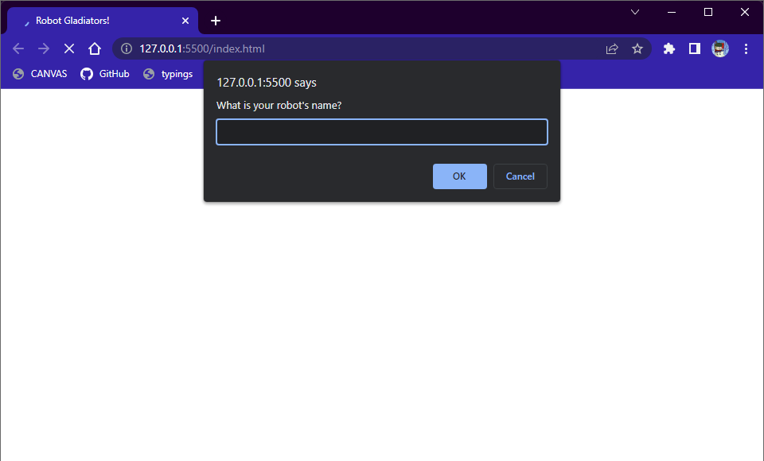

# Robot Gladiators

  
## Description

A browser alert/prompt game where you can enter your robot into battle and clash against other robots. The game is turn-based and you can also upgrade your robot's stats and refill health with in-game currency! Player high-scores are saved to local storage. The game is over when the enemy's or your health is depleted.

## Table of Contents

- [Technologies](#technologies)
- [Installation](#installation)
- [License](#license)
- [Contributing](#contributing)
- [Tests](#tests)
- [Questions](#questions)

## Technologies

This app was built with:
- HTML
- JavaScript

## Installation

To run locally, clone the repository to your local machine and open with your preferred browser.

## License
    
Licensed under the [MIT License](https://spdx.org/licenses/MIT.html)

## Contributing

No contributions will be accepted at this time.

## Tests

No testing is planned for this project at this time.

## Questions

Have questions? Reach me at the following sources!

* GitHub: [realnifty](https://github.com/realnifty)
* E-mail: rogelioalbertopedraza@gmail.com or lovecore@pm.me
